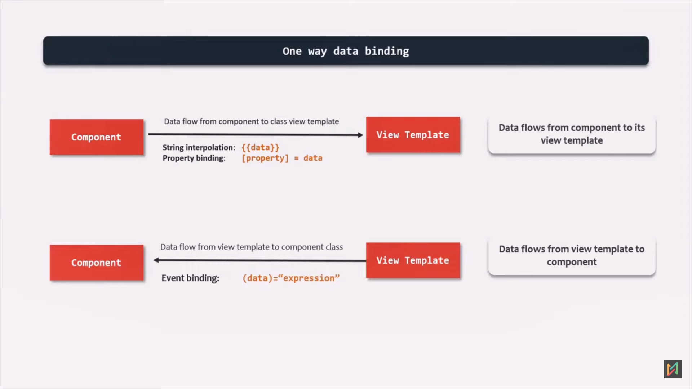
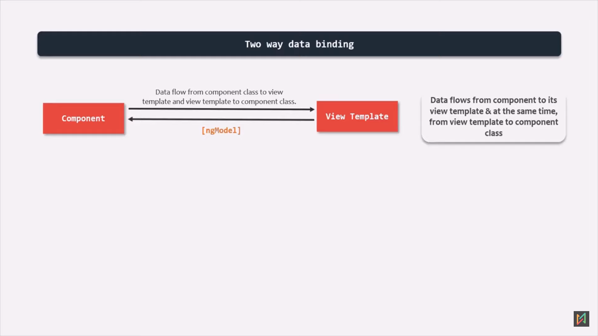

## Angular 
* Angular is a open-source,component based JS framework for building single page client-side application maintained by google.
* Latest Angular is 17 which is completely written in TS


## Angular Working -ng serve


1. Ng serve - command
2. Bundling of files into one or more bundle by the webpack
3. After bundling these bundles are injected to the index.html,By this time the angular core libraries and third party libraries are loaded.
4. Angular searches the angular.json file
5. From this angular.json file ,angular will search for the path of entry point (main.ts and the server.ts)

```json
"options": {
            "outputPath": "dist/ekart",
            "index": "src/index.html",
            "browser": "src/main.ts",
            "polyfills": [
              "zone.js"
            ],
            "tsConfig": "tsconfig.app.json",
            "assets": [
              "src/favicon.ico",
              "src/assets"
            ],
            "styles": [
              "src/styles.css"
            ],
            "scripts": [],
            "server": "src/main.server.ts",
            "prerender": true,
            "ssr": {
              "entry": "server.ts"
            }
          },
```

6. The server will start at this point.
7. PlateFormBrowserDynamic- used to load angular in browser.
8. App module -root module of angular application.
9. The below code will load the appModule

```js

platformBrowserDynamic().bootstrapModule(AppModule)
  .catch(err => console.error(err));

```
10. AppModule is loaded from app.module.ts
11. app.module.ts contains a class(AppModule) and a decorator(@NgModule) which accepts metadata like declarations,imports,providers,bootstrap.
```j
import { NgModule } from '@angular/core';
import { BrowserModule, provideClientHydration } from '@angular/platform-browser';

import { AppRoutingModule } from './app-routing.module';
import { AppComponent } from './app.component';

@NgModule({
  declarations: [
    AppComponent
  ],
  imports: [
    BrowserModule,
    AppRoutingModule
  ],
  providers: [
    provideClientHydration()
  ],
  bootstrap: [AppComponent]
})
export class AppModule { }

```
12. Declarations[] : We need to specify directives,component,pips which belongs to this module.
13. Imports[] : External modules.
14. Providers[] : Register all our services.
15. Bootstrap[] : We specify Component that should be loaded when this module is loaded.
16. AppComponent is Loaded 
17. Contains a component Decorator (@Component) which accepts metaData like selector,templateUrl,template,styleUrls.
```js

import { Component } from '@angular/core';

@Component({
  selector: 'app-root',
  templateUrl: './app.component.html',
  styleUrl: './app.component.css'
})
export class AppComponent {
  title = 'ekart';
}


```
18. Selector : Can be used as an html element(mostly),html class,html attribute.
19. Finally Now the Angular knows what to be rendered.


## Advantages of Typescript 
* Superset of JS.
* TS is strongly typed whereas the JS is dynamically typed.
* TS has some object-oriented features that we don't have in JS like Interfaces,Access Modifiers.
* Statically typed -Type Checking in Compile Time.

## How to create a Component
1. create a TS class and export it.
2. Decorate class with @Component Decorator.
3. Declare in module file.

```ts
import { Component } from "@angular/core";

@Component({
    selector: "app-header",
    templateUrl: './header.component.html',
    styleUrls:['./header.component.css']
})
    
export class HeaderComponent{}
```
4. Use templateUrl if there is lot of html elements.


<h6>Disadvantages of Template & Styles Property</h6>

1. Mixes the TS & HTML code/Style code which makes less maintainable.
2. Change for syntax error is high as Compared to TemplateUrls.


## Data Binding

Data Binding in angular allows to communicate between component class and the view templates & vice versa.

<h6>One Way Data Binding</h6>




1. Dataflow from Component to View template.
 * String Interpolation {{data}}
 * Property Binding [property] =data
2. Dataflow from View template to Component.
 * Event Binding (data) ="expression"

<h6>Two Way Data Binding</h6>



Data flow in both the direction at the same time.
We use ngModel for achieving them.

<h4>String Interpolation</h4>
Example :

```html
 <p>Name: {{ product.name }}</p>
    <p>Price: {{ '$' + product.price }}</p>
    <p>Color: {{product.color}}</p>
```

<h4>Property Binding</h4>
Dataflow from Component Class to view template.

Example :

```html

 
 <button [disabled]="product.inStock <= 0">Buy Now</button>

 //Other Syntax
 <button bind.disabled="product.inStock <= 0">Buy Now</button>
```


When we want to display some data in HTML we use String Interpolation,but when we want to assign some dynamic value to HTML we use property Binding
Disable,Hidden,Check (HTML attribute):String interpolation syntax will not work.

<h4>Event Binding</h4>
Dataflow from view template to Component class.

## Directives


Can be classified into 3 


<h6>Component Directive</h6>

* It is the Angular component.It is a directive with a template.
* Used to render a DOM element

<h6>Attribute Directive</h6>

* Used to change appearance/behavior of a DOM element
* Does not render or remove anything from the WebPage.
* Example:
```js
// Here is how we construct a attribute directive.
@Directive({
  selector:'[changeToGreen]'
})
export class ChangeToGreen{}
```

```html

// Here the changeToGreen is an attribute which changes the color of content to green.
<div changeToGreen>Some Content</div>
```
* We also have build in attribute directives  such as ngStyle and ngClass.

<!-- <p >ngStyle</p> -->
[ngStyle](https://www.telerik.com/blogs/angular-basics-style-binding-angular-ngstyle)
* ngStyle is an attribute directive that updates styles for the containing HTML element in your component.
* It is used to set one or more style properties.
* Example usage:

```html
<ul>
  <li *ngFor="let course of courses" 
  [ngStyle]="{'color': course.color, 'font-size':'24px'}"> 
    {{ course.name }}
  </li>
</ul>
```

[ngClass](https://docs.angularjs.org/api/ng/directive/ngClass)

* The ngClass directive allows you to dynamically set CSS classes on an HTML element by data binding an expression that represents all classes to be added.

* The directive operates in three different ways:
```html
// A space-delimited String 
<div [ngClass]="is-info is-item has-border" ><div/>

// An Array of Strings
<div [ngClass]="['is-info', 'is-item', 'has-border'"]><div/>
 
// An Object 
<div [ngClass]="{'is-info': true, 'is-item': true}><div/>
```
<h6>Structural Directive</h6>

* Structural Directive is used to add or remove a DOM element on Webpage.
* Some of the build in structural Directives are :ngIf,ngFor,ngSwitch.
* Whenever we use a structural directive, we precede it with an asterisk (*) mark.
```html
<div *ngIf>Some Content</div>

```

<p>ngFor</p>

* Angular ngFor directive iterates over a collection of data like an array,list,etc.  and creates a HTML element of each of the items from an HTML template.
* It is a Structural Directive,it manipulates the DOM by adding/removing elements from the DOM.

```html
<div *ngFor="let item of [2,3,4,5,6]">
  <p>Current element of array is : {{item}}</p>
</div>
```

  <p>ngIf</p>

  